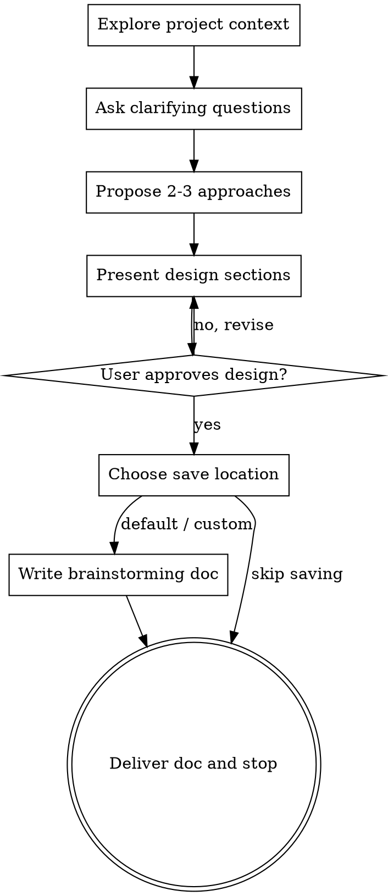

# Brainstorming Ideas Into Designs

## Overview

Turn ideas into clear, approved brainstorming documents through collaborative dialogue.

Always support role-based brainstorming:
- If the user specifies a role, follow that role's perspective (for example: PM, frontend architect, backend architect, UX designer).
- If no role is specified, use the `general strategist` role.

<HARD-GATE>
Do NOT invoke any implementation skill, write any code, scaffold any project, or take any implementation action until you have presented the design and the user has approved it.
</HARD-GATE>

## Anti-Pattern: "This Is Too Simple To Need Design"

Every project must follow this process, even for small changes.
The design can be short for simple ideas, but it still must be presented and approved.

## Checklist

You MUST complete these items in order:

1. Explore project context: inspect files, docs, and recent commits.
2. Ask clarifying questions: one question per message.
3. Propose 2-3 approaches: include trade-offs and recommendation.
4. Present design sections: architecture, components, data flow, error handling, testing; get user approval section by section.
5. When the topic is planning-oriented, explicitly ask which target object the brainstorming is for: `roadmap`, `milestone`, `phase`, `task`, or `generic topic`.
6. When relevant, ask whether the brainstorming should build on an existing object or reference set (for example an existing roadmap, milestone, phase, or multiple task/phase refs).
7. Write brainstorming doc: ask for save location choice before writing. In planning-layer scenarios, distinguish between default brainstorming directory, target-object directory, custom directory, and skip saving.
8. Stop after delivering the brainstorming doc: do not transition to implementation planning.

## Process Flow

Terminal state is `Deliver doc and stop`.
Do NOT invoke writing-plans or any implementation skill afterward.

## Save Location Rule (Required)

Before any file write, always ask the user to choose where the brainstorming doc should live.

### Standard choices
1. Default directory: `docs/brainstorming/`
2. Custom directory: user-provided path
3. Skip saving: do not write any file

### Extra choice for planning-layer targets
If the brainstorming target is `roadmap`, `milestone`, or `phase`, also offer:
4. Target object directory: save the brainstorming doc next to the target object's primary file when the user explicitly wants the doc colocated with that object.

### Decision rule
- If the user has not asked for colocated storage, prefer `docs/brainstorming/` as the default.
- Only use the target object directory when the user explicitly wants the brainstorming doc attached to that roadmap/milestone/phase.
- Only use a custom directory when the user explicitly provides one.
- If the user chooses skip saving, do not write any file.

### Filename rule
If the user chooses default, custom, or target object directory, use:
- `<topic>-YYYY-MM-DD-brainstorming.md`

For the default directory, the full path becomes:
- `docs/brainstorming/<topic>-YYYY-MM-DD-brainstorming.md`

For a target object directory, keep the same filename pattern and place it in that object's directory.

Place the topic first so related brainstorming docs group together more naturally during directory browsing, with the date still preserved for chronology.

For a custom directory, write to the exact directory the user provides with the same filename pattern.

If the user chooses skip saving, do not write any file — output the doc content inline in the chat only.

## Questioning Rules

- Ask only one question per message.
- Prefer multiple-choice questions where possible.
- Focus on purpose, constraints, and success criteria.
- Go back and re-clarify when responses are ambiguous.

## Design Presentation Rules

- Present 2-3 approaches before finalizing.
- Lead with the recommended option and explain why.
- Keep each section concise for simple tasks and detailed for complex tasks.
- Ask for approval after each section.

## Doc Content Guidelines

Include:
- Role used for brainstorming (explicit role or `general strategist`)
- Target object (`roadmap`, `milestone`, `phase`, `task`, or `generic topic`) when relevant
- Problem statement and goals
- Constraints and assumptions
- Candidate approaches with trade-offs
- Recommended design
- For planning-layer topics, explicitly restate that `task` remains the only execution unit and that planning artifacts are planning/display objects
- Risks and mitigations
- Validation/test strategy
- Open questions (if any)

Do not include implementation code.

## Completion Criteria

Only finish when:
1. The user has approved the design.
2. The user has chosen one of the allowed save destinations for the doc (`docs/brainstorming/`, target object directory when applicable, custom directory, or skip saving).
3. The brainstorming doc has been written to file (default/target-object/custom) or output inline (skip saving), and shared.
